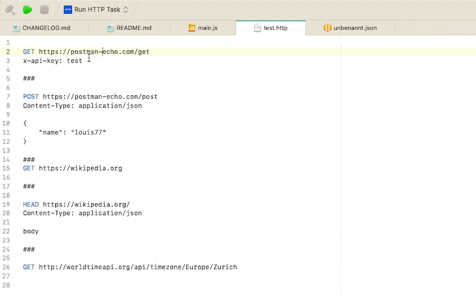

# HTTP Client Nova extension

**HTTP Client** provides a **Run HTTP** editor command to make HTTP calls from a *.http file.



## Getting started

1. Create a file with "http" extension

2. Write a HTTP verb and URL in a line:

```
GET https://wikipedia.org
```

3. Put the cursor on the line, right-click and click on the "Run HTTP" command (or Editor > Run HTTP).

4. HTTP Client will open a new editor with the result of the request (HTTP & body). It detects if the response is HTML or JSON and selects the appropriate syntax in Nova.

## Features

HTTP Client is still very simple and doesn't provide support for HTTP headers or body (yet).
Let me know if you find the extension useful and what features you want to see.