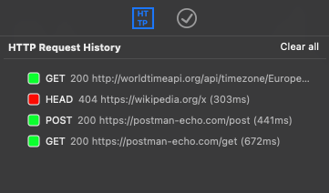

<a name="readme-top"></a>

<br />
<div align="center">
  <a href="https://github.com/louis77/nova-http-client">
	
  </a>
</div>

# HTTP Client extension for Nova

**HTTP Client** is an extension for the [Nova editor](https://nova.app) to make HTTP calls from a *.http file.

Includes:
- HTTP Syntax highlighting
- Run HTTP command
- Run HTTP task
- Sidebar with request history


## Getting Started

1. Install the extension from the [Nova extensions library](https://extensions.panic.com/extensions/louis77/louis77.http-client/).

1. Create a file with "http" extension

2. Write a HTTP verb and URL in a line:

```
GET https://wikipedia.org
```

3. Put the cursor on the line and press CMD-R or right-click and select the "Run HTTP" command

4. HTTP Client will open a new editor with the result of the request (HTTP & body). It detects if the response is HTML, JSON or XML and selects the appropriate syntax in Nova.

<p align="right">(<a href="#readme-top">back to top</a>)</p>


## Requests

### Add request headers

Place HTTP header directly below Verb/URL:

```
GET https://postman-echo.com/get
x-api-key: test
x-version: 1.0
```

### Add request body

Separate the body with an empty line after URL/headers:

```
POST https://postman-echo.com/post
Content-Type: application/json

{
  "name": "louis77"
}
```

You can also specify file path to use as a body, which starts with < :

```
POST https://postman-echo.com/post
Content-Type: application/json

< /home/joe/payload.json

```


### Multiple requests

Separate multiple request in the same file with `###` on a separate line. There is also a Clip for the separator, just type "s" and let the extension auto-complete.

Place the cursor anywhere inside a request when running it.

```
GET https://postman-echo.com/get
x-api-key: test
x-version: 1.0

###

POST https://postman-echo.com/post
Content-Type: application/json

{
  "name": "louis77"
}
```

<p align="right">(<a href="#readme-top">back to top</a>)</p>


## Execute HTTP requests

You have several options to execute the current HTTP request:

1. Right-click and select "Run HTTP"
2. Press CMD-R
3. Bring up the command palette (CMD-SHIFT-P) and search for "Run HTTP"
4. Click on the "Run HTTP Task" run button
5. Use the menu "Editor > Run HTTP"

The cursor must always be anywhere inside an HTTP request.

<p align="right">(<a href="#readme-top">back to top</a>)</p>


## History Sidebar

**HTTP Client** features a sidebar to list your request history:




## Settings

This extension provides a few settings to customize its behaviour:

- Follow Redirects (3xx responses) (default: true)


<p align="right">(<a href="#readme-top">back to top</a>)</p>


## Limitations

- Non text-based responses (i.e. binary, images) are not supported yet

<p align="right">(<a href="#readme-top">back to top</a>)</p>


## Roadmap

Let me know if you find the extension useful and what features you want to see.

- [X] Basic HTTP requests 
- [X] Show latency in output
- [X] Show HTTP response headers in output
- [X] Add support to provide HTTP headers
- [X] Add support to provide HTTP body
- [X] Accept local filenames as body payload
- [X] Support for XML responses
- [X] Clips for basic requests
- [X] Setting to define a timeout
- [X] Auto-completion for common request headers and MIME types
- [X] Request history in a sidebar
- [ ] Option to include request (w/o body) in response output
- [ ] Look for a global "requests.http" to populate Task list
- [ ] Variables
- [ ] Allow text on separator line (i.e. ### my request)

<p align="right">(<a href="#readme-top">back to top</a>)</p>


## Contributing

Contributions are what make the open source community such an amazing place to learn, inspire, and create. Any contributions you make are **greatly appreciated**.

If you have a suggestion that would make this better, please fork the repo and create a pull request. You can also simply open an issue with the tag "enhancement".
Don't forget to give the project a star! Thanks again!

1. Fork the Project
2. Create your Feature Branch (`git checkout -b feature/AmazingFeature`)
3. Commit your Changes (`git commit -m 'Add some AmazingFeature'`)
4. Push to the Branch (`git push origin feature/AmazingFeature`)
5. Open a Pull Request

<p align="right">(<a href="#readme-top">back to top</a>)</p>


## Donate

If you like this extension and want it to get better over time, please consider showing your appreciation by [donating a small tip](https://www.paypal.com/donate/?hosted_button_id=T5QY5WE7AV2T6). Thank you!

<p align="right">(<a href="#readme-top">back to top</a>)</p>


## License

Distributed under the GPL-3-or-later. See `LICENSE.txt` for more information.

<p align="right">(<a href="#readme-top">back to top</a>)</p>


## Contact

Louis Brauer - [@BrauerLouis1](https://twitter.com/BrauerLouis1) - louis@brauer.family

Project Link: [https://github.com/louis77/nova-http-client](https://github.com/louis77/nova-http-client)

<p align="right">(<a href="#readme-top">back to top</a>)</p>